<!--
╔══════════════════════════════════════════════════════════════╗
║              ARITRA CHATTERJEE · PROFILE README             ║
║        theme: Linux terminal · hacker · GitHub dark         ║
║        accent: #7ee787                                      ║
╚══════════════════════════════════════════════════════════════╝
-->

<div align="center">



<br/><br/>

<a href="https://github.com/Ari07-IND">

</a>&nbsp;

<a href="https://www.linkedin.com/in/aritra-chatterjee-b76726303">

</a>&nbsp;

<a href="mailto:ac7605859@gmail.com">

</a>&nbsp;


<br/><br/>


</div>

## <samp>$ whoami</samp>

<table border="0" width="100%">
<tr>

<td width="62%" valign="top">

<samp>B.Tech CSE (AI) · AI/ML · robotics · systems explorer</samp>

<br/><br/>

I'm Aritra Chatterjee — a Computer Science student specializing in **Artificial Intelligence**, interested in the intersection of intelligent software, physical systems and real-world engineering.

I like understanding the problem before touching the implementation, experimenting with ideas, and turning concepts into systems that can actually work outside a notebook.

> <samp>learn deeply · build deliberately · iterate relentlessly</samp>

<br/>

<samp>NOW</samp>

* 🟢 **AI / ML** — exploring intelligent learning systems
* 🟢 **Computer Vision** — perception, image understanding & visual intelligence
* 🟢 **Robotics** — sensors, automation & intelligent machines
* 🟢 **Embedded AI** — connecting intelligence with physical systems
* 🟢 **Research** — exploring technology with real-world impact

<br/>

<samp>OPEN TO</samp>

* meaningful technical collaboration
* research & innovation
* AI / robotics experiments
* hackathons & engineering challenges
* building systems that solve real problems

</td>

<td width="4%"></td>

<td width="34%" valign="middle" align="center">


<br/><br/>

<sub><samp>// powered by curiosity · caffeine · terminal</samp></sub>

<br/><br/>

```text
┌──────────────────────┐
│ SYSTEM STATUS        │
├──────────────────────┤
│ OS       :: Linux    │
│ MODE     :: BUILD    │
│ AI       :: ACTIVE   │
│ RESEARCH :: ACTIVE   │
│ STATUS   :: ONLINE   │
└──────────────────────┘
```

</td>

</tr>
</table>

<div align="center">

</div>

## <samp>$ cat /etc/identity</samp>

<table width="100%" border="0">
<tr>

<td width="50%" valign="top">

```text
USER
────────────────────────────────
name       : Aritra Chatterjee
handle     : Ari07-IND
location   : West Bengal, India
status     : student / builder
```

</td>

<td width="50%" valign="top">

```text
EDUCATION
────────────────────────────────
degree     : B.Tech CSE (AI)
institute  : IEM Newtown
university : UEM Kolkata
focus      : Artificial Intelligence
```

</td>

</tr>
</table>

## <samp>$ systemctl status aritra</samp>

```text
● aritra.service - AI / Robotics Development Environment
     Loaded: loaded
     Active: active (running)

     ├── artificial-intelligence.service    [ ACTIVE ]
     ├── machine-learning.service           [ ACTIVE ]
     ├── computer-vision.service             [ ACTIVE ]
     ├── robotics.service                    [ ACTIVE ]
     ├── embedded-ai.service                 [ ACTIVE ]
     ├── research.service                    [ ACTIVE ]
     └── curiosity.service                   [ ALWAYS ]

     Process:
       learning      → running
       experimenting → running
       building      → running
       improving     → running
```

<div align="center">

</div>

## <samp>$ cat stack.json</samp>

<table border="0" width="100%">
<tr>

<td align="center" valign="top" width="50%">

**languages**

<br/><br/>


<br/><br/>

<sub>
Python · C · C++ · Java · JavaScript
</sub>

<br/><br/>

**ai / machine learning**

<br/><br/>


<br/><br/>

<sub>
Machine Learning · Deep Learning · Computer Vision
</sub>

</td>

<td width="4%"></td>

<td align="center" valign="top" width="46%">

**hardware / embedded**

<br/><br/>


<br/><br/>

<sub>
Arduino · ESP32 · Raspberry Pi · Sensors · IoT
</sub>

<br/><br/>

**development**

<br/><br/>


<br/><br/>

<sub>
Git · GitHub · Linux · VS Code · Docker
</sub>

</td>

</tr>
</table>

<div align="center">

</div>

## <samp>$ ls -la ~/research</samp>

```text
drwxr-xr-x  artificial-intelligence/
drwxr-xr-x  machine-learning/
drwxr-xr-x  deep-learning/
drwxr-xr-x  computer-vision/
drwxr-xr-x  robotics/
drwxr-xr-x  embedded-systems/
drwxr-xr-x  edge-ai/
drwxr-xr-x  iot/
drwxr-xr-x  assistive-technology/
drwxr-xr-x  human-centered-ai/
```

<table width="100%" border="0">
<tr>

<td width="33%" align="center">

### `01`

**ARTIFICIAL
INTELLIGENCE**

Learning systems
Neural networks
Intelligent decision making

</td>

<td width="33%" align="center">

### `02`

**ROBOTICS**

Sensors
Automation
Physical intelligence

</td>

<td width="33%" align="center">

### `03`

**COMPUTER VISION**

Image processing
Visual perception
Machine intelligence

</td>

</tr>

<tr>

<td width="33%" align="center">

### `04`

**EMBEDDED AI**

Edge intelligence
IoT
Microcontrollers

</td>

<td width="33%" align="center">

### `05`

**ASSISTIVE TECH**

Human-centered systems
Safety
Accessibility

</td>

<td width="33%" align="center">

### `06`

**RESEARCH**

Experimentation
Prototyping
Real-world impact

</td>

</tr>
</table>

## <samp>$ tail -f /var/log/learning.log</samp>

```text
[INFO] loading machine-learning.................... OK
[INFO] loading deep-learning....................... OK
[INFO] loading computer-vision..................... OK
[INFO] loading robotics............................ OK
[INFO] loading embedded-ai.......................... OK
[INFO] loading edge-computing....................... OK
[INFO] loading system-design....................... OK
[INFO] loading research-methodology................. OK

[INFO] learning_mode = CONTINUOUS
[INFO] curiosity_level = HIGH
[INFO] build_mode = ENABLED
```

<div align="center">

</div>

## <samp>$ git log --stat</samp>

<div align="center">


 


<br/><br/>


<br/><br/>


</div>

<div align="center">

</div>

## <samp>$ ./achievements.sh</samp>

<div align="center">


<br/><br/>

<sub><samp>achievement unlocked → by building, contributing & staying consistent</samp></sub>

</div>

## <samp>$ cat hackathons.md</samp>

```text
┌──────────────────────────────────────────────────────────────┐
│                    HACKATHON MODE                            │
├──────────────────────────────────────────────────────────────┤
│                                                              │
│  BUILD        → under constraints                            │
│  THINK        → under pressure                               │
│  SHIP         → before the clock runs out                    │
│  LEARN        → from every iteration                         │
│                                                              │
└──────────────────────────────────────────────────────────────┘
```

I'm interested in hackathons as compressed engineering environments — places where research, design, implementation and presentation have to converge quickly.

```text
hackathon mindset:

    IDEA
      ↓
    VALIDATE
      ↓
    ARCHITECT
      ↓
    BUILD
      ↓
    TEST
      ↓
    SHIP
```

<div align="center">

</div>

## <samp>$ cat philosophy.md</samp>

<table border="0" width="100%">
<tr>

<td valign="top" width="25%" align="center">

<kbd> 01 </kbd>

**understand**

<br/>

<sub><samp>problem first</samp></sub>

<br/><br/>

Understand the domain before writing the solution.

</td>

<td valign="top" width="25%" align="center">

<kbd> 02 </kbd>

**research**

<br/>

<sub><samp>question assumptions</samp></sub>

<br/><br/>

Explore the problem deeply before deciding how to solve it.

</td>

<td valign="top" width="25%" align="center">

<kbd> 03 </kbd>

**build**

<br/>

<sub><samp>prototype early</samp></sub>

<br/><br/>

A working imperfect system teaches more than an unfinished idea.

</td>

<td valign="top" width="25%" align="center">

<kbd> 04 </kbd>

**iterate**

<br/>

<sub><samp>improve continuously</samp></sub>

<br/><br/>

Test, learn, refine and keep moving forward.

</td>

</tr>
</table>

## <samp>$ cat /etc/motd</samp>

<div align="center">

```text
┌─────────────────────────────────────────────────────────────┐
│                                                             │
│  "The goal isn't to build the most complicated system.      │
│   It's to build the right system for the problem."          │
│                                                             │
└─────────────────────────────────────────────────────────────┘
```

</div>

## <samp>$ ./connect.sh</samp>

<div align="center">

<a href="https://github.com/Ari07-IND">

</a>&nbsp;

<a href="https://www.linkedin.com/in/aritra-chatterjee-b76726303">

</a>&nbsp;

<a href="mailto:ac7605859@gmail.com">

</a>

<br/><br/>

<sub>
<samp>aritra@github:~$ echo "let's build something that matters"</samp>
</sub>

<br/><br/>


<br/><br/>

<sub>
<samp>west bengal, india · UTC+5:30 · b.tech cse (ai) · iem newtown · uem kolkata</samp>
</sub>

<br/><br/>


<br/><br/>

<samp>aritra@github:~$ exit</samp>

</div>
<!--
EOF
-->
